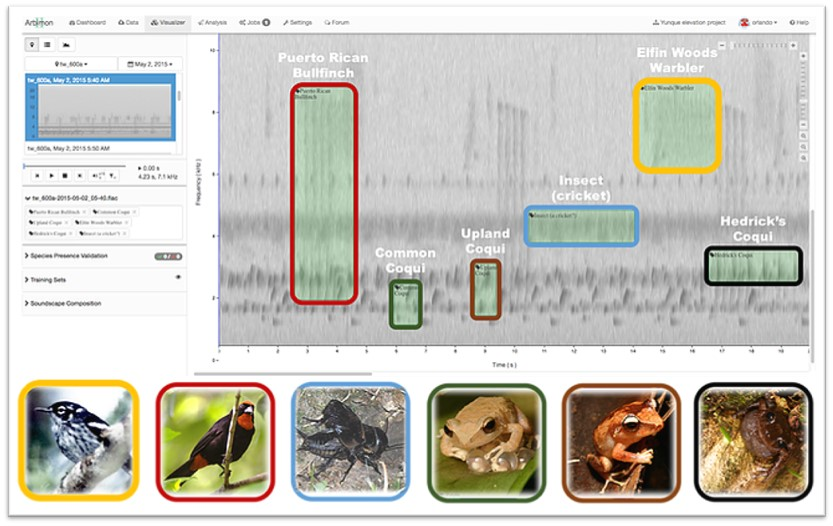

## Introduction

This project is collaborative work among the [AI for Earth](https://aka.ms/aiforearth) team at Microsoft, the [AI for Good Research Lab](http://aka.ms/aiforgood) at Microsoft, and [Sieve Analytics](https://www.sieve-analytics.com/).

With audio recordings collected from rainforests in Puerto Rico, we build a deep learning model that combines transfer learning and pseudo-labeling as a data augmentation technique to: 1) train a deep convolutional neural network (CNN) model, 2) evaluate the model against a test set of audio clips with labeled species presence or absence, and 3) automate the detection of 24 species of birds and frogs from 1-minute field recordings. The main focus of this study was species of Greatest Conservation Need according to the State Wildlife Action Plan, but we also included some other common species in Puerto Rico (e.g., the common coqui (a type of frog), the pearly-eyed thrasher (a common bird), and the scaly-naped pigeon).

# Data

Audio data was collected by Sieve Analytics from ~700 sampling sites across the mountains of Puerto Rico from 2015 to 2019. Audio recordings were collected using portable acoustic recorders, which were programmed to record 1 minute of audio every 10 minutes, 24 hours per day, for 1-2 weeks per sampling site. 

# Methodology

We extracted mel spectrograms for each validated detection, and use them along with the associated labels as the input to a multi-label multi-class classification model. Three deep learning CNN models were trained:

* Model 1: Built a CNN from scratch using VGG16 architecture.
* Model 2: Transfer learning with fine-tuning from a pre-trained ResNet50 model.
* Model 3: Transfer learning with fine-tuning from a pre-trained ResNet50 model, using custom loss function with pseudo labeling.

# Contributing

This project welcomes contributions and suggestions.  Most contributions require you to agree to a
Contributor License Agreement (CLA) declaring that you have the right to, and actually do, grant us
the rights to use your contribution. For details, visit https://cla.opensource.microsoft.com.

When you submit a pull request, a CLA bot will automatically determine whether you need to provide
a CLA and decorate the PR appropriately (e.g., status check, comment). Simply follow the instructions
provided by the bot. You will only need to do this once across all repos using our CLA.

This project has adopted the [Microsoft Open Source Code of Conduct](https://opensource.microsoft.com/codeofconduct/).
For more information see the [Code of Conduct FAQ](https://opensource.microsoft.com/codeofconduct/faq/) or
contact [opencode@microsoft.com](mailto:opencode@microsoft.com) with any additional questions or comments.
